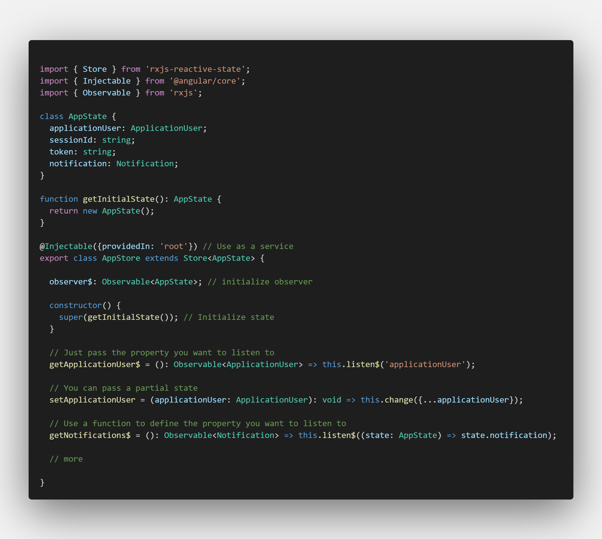
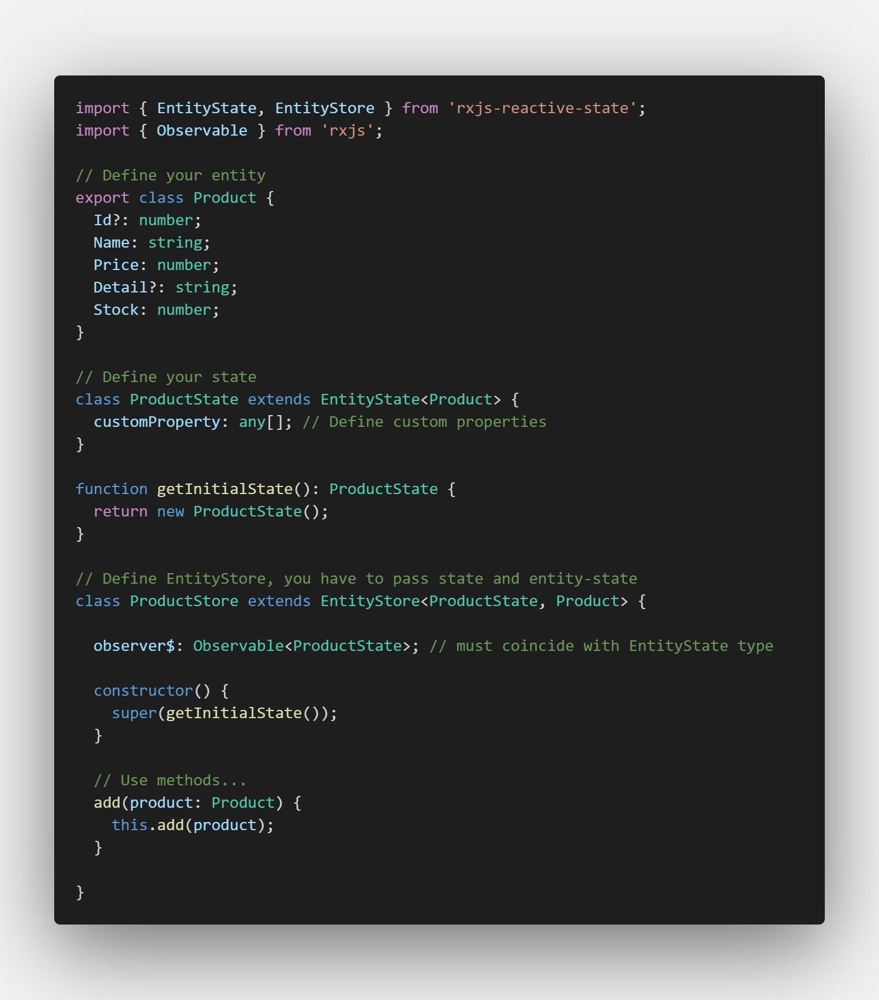
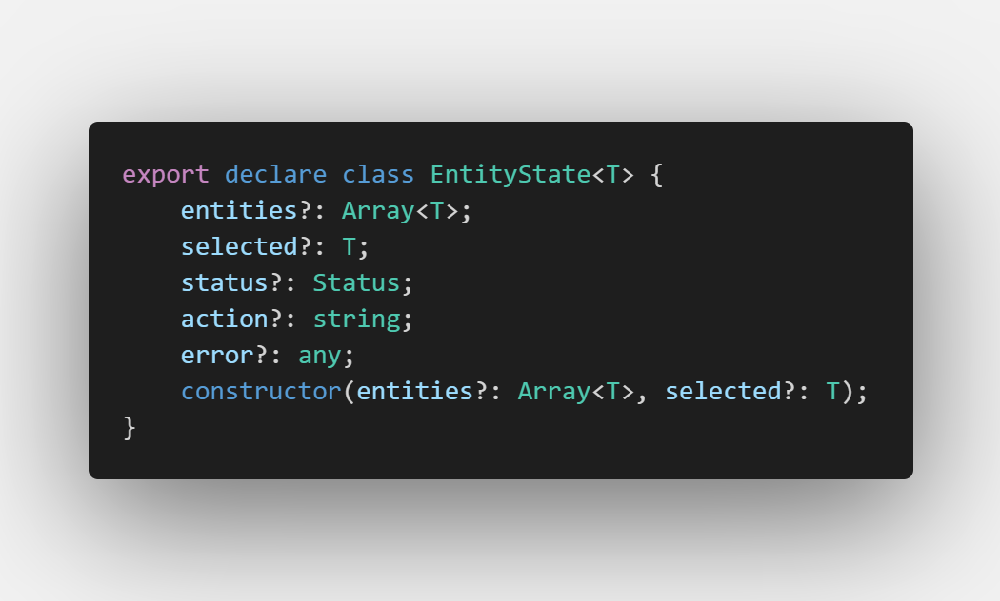
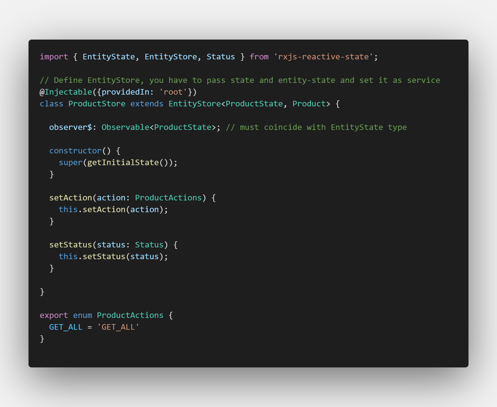

# rxjs-reactive-state: Reactive State with RxJS

RxJS powered state management library for Reactive Applications implementing observable store. Go to https://github.com/ramartinez7/angular-observable-store to see a full implementation in an use case with Angular (under construction).

### Installation

```sh
npm i rxjs-reactive-state --save
```

Extension recommended: Auto Import, link: https://marketplace.visualstudio.com/items?itemName=steoates.autoimport

### API
The classes are strongly-typed so you will have a lot of help of intellisense in VS Code. Exist two main classes: Store < T > and EntityStore<S extends EntityState<T>, T> extends Store<S

```sh
  Store<T> where T is your state class, example: 
```
  
    


| type | name | description | Example |
| ------ | ------ | ------ | ------ |
| property | observer$ | Observable state | 
| property | state | State value
| property | logActions | Wheter log actions in console or not
| method | change | Change state value | this.store.change({ products: products }), this.store.change(state => ({...}))
| method | listen | Listen to changes in state | this.store.listen(), this.store.listen(state => state.entities), this.store.listen('products'), this.store.listen(['name', 'email'])
| method | destroy | Completes the store subject.

```sh
  EntityStore<S extends EntityState<T>, T> extends Store<S>, you have to set the entity-state and entity class, example:
```
  
   

```sh
  EntityState<T> class looks like this
```
   

EntityStore class extends the properties and methods from Store class. Also,

| type | name | description | Example |
| ------ | ------ | ------ | ------ |
| method | add | adds one or many items to the entities property  | this.store.add(product)
| method | update | updates one property in the entities property, recieves a function with a boolean expression to find the element to update and the new element | this.store.update(product => product.id === 1, new Product())
| method | remove | remove an element from the entities property, recieves a function to find the element  | this.store.remove(product => product.id === 1)
| method | exists | Verifies if an element exists in the entities property, recieves a function to search the element | this.store.exists(product => product.id === 1)
| method | setAction | Sets the current action, recieves a string and by default starts with LOADING status |  this.store.setAction(ProductActions.GET_ALL);
| method | setStatus | Set the state of the current action (LOADING, SUCCESS, FAILED, COMPLETE) | this.store.setStatus(Status.FAILED)


```sh
  Actions and Status
```

To control changes to the state you can use Actions and Status, example:

   

Here you must use the Status enum imported from the package.


Submit an issue or fork the project to improve it. Soon I'll be posting more info about the implementation of the library.
Go to https://github.com/ramartinez7/angular-observable-store to see a full implementation in an use case with Angular (under construction).
